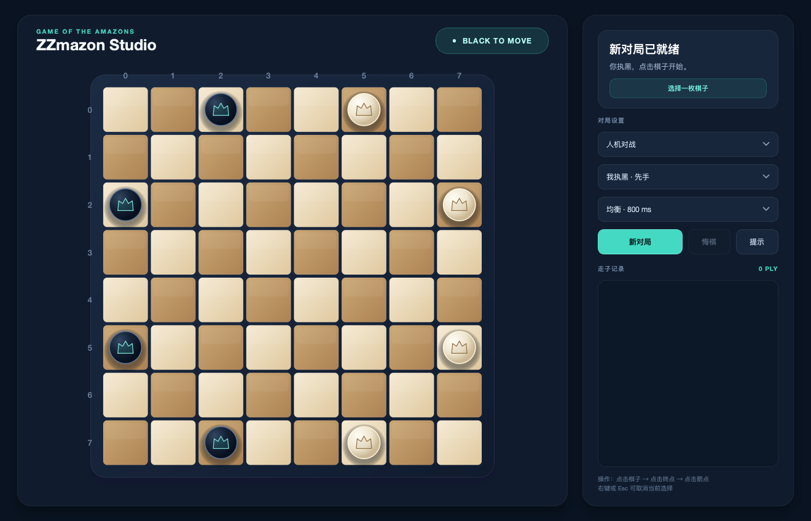
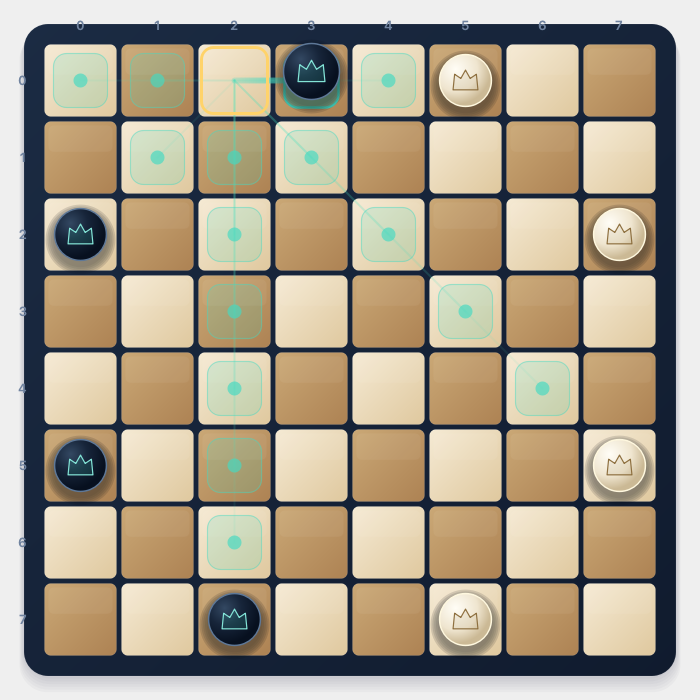
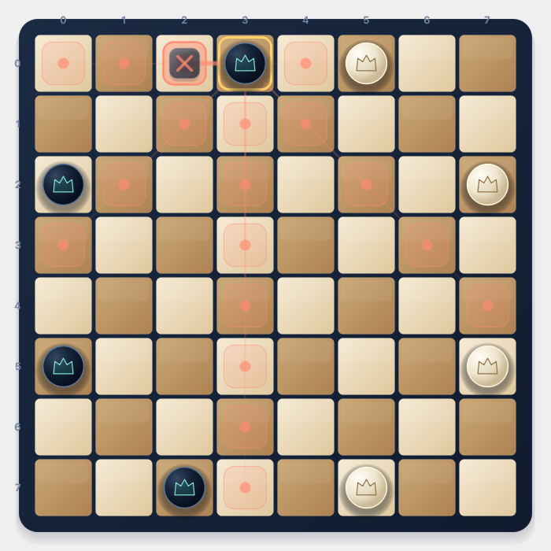

# ZZmazon

一个面向 8×8 亚马逊棋（Game of the Amazons）的 C++ 博弈项目，包含原生 Qt 图形客户端、终端交互版、Botzone 单文件版和自对弈实验工具。



## 项目版本

| 程序 | 入口 | 用途 |
| --- | --- | --- |
| **ZZmazon Studio** | `src/zzmazon_cli_plus.cpp` | 推荐使用。Qt 6 图形客户端，支持鼠标操作、两阶段轨迹高亮、自然落子动画、人机/双人模式、悔棋与提示。 |
| **终端交互版** | `src/zzmazon_cli.cpp` | 纯终端体验，支持人机对战、双人对战、难度调整、局势显示、存档和复盘。 |
| **Botzone 版** | `src/zzmazon_botzone.cpp` | 无项目内依赖的单文件程序，读取 Botzone 历史走法并输出最佳落子。 |

## 图形增强版

ZZmazon Studio 使用原生 Qt Widgets 和 `QPainter` 矢量绘制，不依赖浏览器或图片棋子素材，并支持高 DPI 缩放。

一次完整落子严格分成两个阶段：

1. **移动棋子**：点击己方棋子后，以青色光轨展示全部合法终点；悬浮终点会预览棋子位置。点击终点后，棋子抬升、移动并自然落下。
2. **发射障碍**：棋子落稳后，才以珊瑚色光轨展示合法箭点；点击箭点后，箭沿轨迹飞行并落成障碍。

| 第一步：移动棋子 | 第二步：发射障碍 |
| --- | --- |
|  |  |

其他功能包括：

- 人机对战与本地双人模式；
- 自由选择执黑或执白；
- 350 / 800 / 1500 ms 三档 AI 思考时间；
- 异步 AI 搜索，窗口和动画不会被阻塞；
- 新对局、成对悔棋、AI 路线提示和走子记录；
- `Ctrl+N` 新对局、`Ctrl+Z` 悔棋、`Esc`/右键取消选择。

详细设计见 [ZZmazon Studio 文档](docs/cli-plus.md)。

## 算法概览

竞技版与原终端版采用蒙特卡洛树搜索（MCTS），结合 UCT 选择、渐进扩展、启发式预选、随机采样和时间感知剪枝。局面评估综合皇后距离、国王距离、领地和机动性，并使用分阶段参数。

图形增强版目前使用独立的异步搜索引擎，通过皇后距离场、领地、机动性与对手回应采样选步。GUI 与引擎分层，后续可以在不改界面的前提下接入统一 MCTS 核心。

课程报告对搜索与评估设计有更完整的说明：

- [课程报告（Markdown）](docs/course-report.md)

## 目录结构

```text
.
├── CMakeLists.txt
├── src/
│   ├── zzmazon_cli_plus.cpp      # Qt 图形增强版入口
│   ├── cli_plus/
│   │   ├── amazons_game.*        # 规则、状态、悔棋与异步 AI
│   │   ├── board_widget.*        # 棋盘、两阶段交互与动画
│   │   ├── main_window.*         # 模式、侧栏与对局流程
│   │   └── theme.qss             # 深色界面主题
│   ├── zzmazon_cli.cpp           # 终端交互版
│   └── zzmazon_botzone.cpp       # Botzone 单文件版
├── tests/                        # 增强版规则和 GUI 交互测试
├── experiments/self_play/        # 历史候选版本与并行对弈脚本
└── docs/                         # 客户端说明、课程报告与截图
```

编译产物统一写入 `build/bin/`。终端版运行时生成的 `save.txt`、CMake 产物和平台调试文件均已加入 `.gitignore`。

## 构建要求

- 支持 C++17 的编译器；
- CMake 3.16 或更高版本；
- 构建图形增强版时需要 Qt 6 `Widgets` 与 `Concurrent`；
- 运行 GUI 回归测试时可选安装 Qt 6 `Test`。

Qt GUI 默认开启。如果 CMake 找不到 Qt 6，会显示警告并继续构建终端版和 Botzone 版。

## 构建

```bash
cmake -S . -B build -DCMAKE_BUILD_TYPE=Release
cmake --build build --parallel
```

生成的主要程序：

```text
build/bin/zzmazon_cli_plus   # Qt 图形增强版
build/bin/zzmazon_cli        # 终端交互版
build/bin/zzmazon_botzone    # Botzone 协议版
```

不需要 Qt GUI 时可显式关闭：

```bash
cmake -S . -B build -DZZMAZON_BUILD_GUI=OFF
```

## 运行

推荐运行图形增强版：

```bash
./build/bin/zzmazon_cli_plus
```

运行终端版：

```bash
./build/bin/zzmazon_cli
```

## Botzone 提交

`src/zzmazon_botzone.cpp` 是无项目内依赖的单文件程序，可直接作为 Botzone Bot 源码提交。程序向标准输出写出六个整数：

```text
起点行 起点列 终点行 终点列 箭落点行 箭落点列
```

## 自对弈实验

实验版本默认不参与构建，需要时显式开启：

```bash
cmake -S . -B build \
  -DCMAKE_BUILD_TYPE=Release \
  -DZZMAZON_BUILD_EXPERIMENTS=ON
cmake --build build --parallel

python3 experiments/self_play/judge.py \
  --bot-a build/bin/original \
  --bot-b build/bin/t1 \
  --rounds 20
```

更多说明见 [自对弈实验文档](experiments/self_play/README.md)。

## 测试

```bash
cmake -S . -B build -DBUILD_TESTING=ON
cmake --build build --parallel
ctest --test-dir build --output-on-failure
```

当前测试覆盖：

- 初始棋盘、合法移动、射回原位置、状态切换和悔棋；
- AI 返回走法的合法性；
- 鼠标依次选择棋子、终点和箭点；
- 棋子落下后才进入射箭阶段；
- 棋子移动与障碍落下两段动画的完成状态。

## License

本项目使用 [MIT License](LICENSE)。
