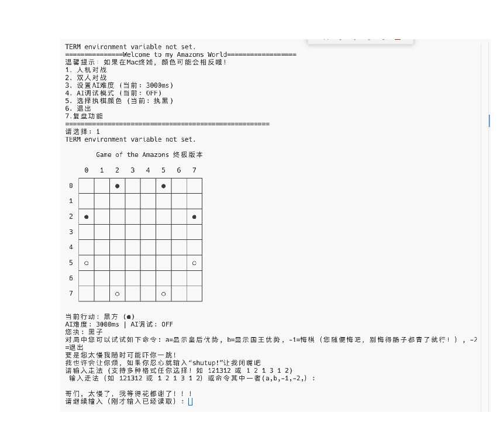
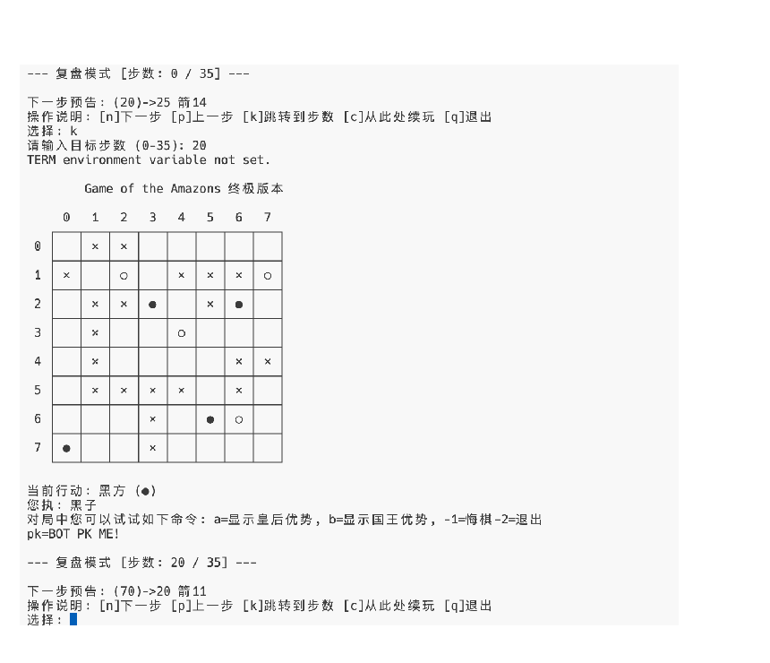
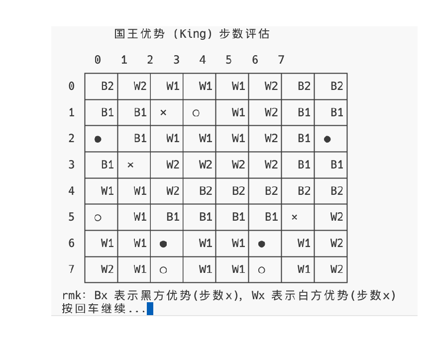
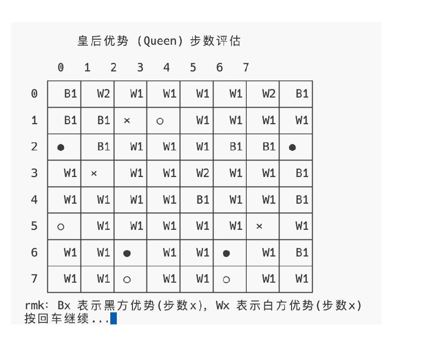
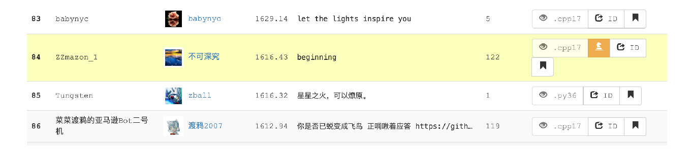

# 经验之死？——蒙特卡洛模拟划定的亚马逊棋博弈边界

> 关于 MCTS 架构的亚马逊棋博弈程序的探索与实现 
> 信息科学技术前沿与产业创新课程报告

| 项目 | 内容 |
| --- | --- |
| 作者 | flowwalker |
| 院系 | 北京大学信息科学技术学院 |
| Bot 名称 | ZZmazon |
| 日期 | 2026 年 1 月 9 日 |

## 摘要

在信息科技领域的前沿，博弈算法始终是衡量“硅基智能”演化程度的核心标尺。作为大一新生，在本次双创课论文的选题上，我选择从探索和设计亚马逊棋程序入手，切入当今时代的“智能”话题。

本文将总结我在本学期课余时间，基于 UCT 策略的蒙特卡洛树搜索（MCTS）架构所设计的各类剪枝策略、创新性的六维度评估函数，以及可在本地终端体验的 UI 接口；后者包含悔棋、存档等完整功能。

## 1. 引言

开发本程序的初衷并非仅为了完成一项技术任务，更多是源于从前对博弈思维演化的好奇，于是我看上了亚马逊棋……

亚马逊棋（Game of the Amazons）规则简洁但策略极深，详细规则可参见[亚马逊棋维基百科](https://zh.wikipedia.org/wiki/%E4%BA%9E%E9%A6%AC%E9%81%9C%E6%A3%8B)。

我一共开发了两个版本：逻辑层（竞技型）与界面层（体验型）。前者在 Botzone 平台有限算力下已达到前 8% 的水平；后者提供终端 UI，既可与舍友双人对决，也可用于调试 Bot、观察评估与局势。

项目代码现已开源，见 [The-Bot-of-Amazons](https://github.com/flowwalker/The-Bot-of-Amazons)。

## 2. 基于 MinMax 思想架构的 MCTS 决策模型

针对亚马逊棋单步约 2,100 个分支因子的计算压力，本程序摒弃了依赖深层搜索的传统 Minimax 算法，参考 Amazong 和 Invader 等著名 Bot 的论文，转而采用以蒙特卡洛树搜索（MCTS）为核心、以 UCT 算法为决策准则的 MinMax 架构。

### 2.1 决策准则：基于 UCT 的数学平衡

本程序引入了兼顾历史胜率与强制探索低访问节点的 UCT 算法。对于父节点 $p$ 及其子节点 $v_i$，选择依据为：

$$
\operatorname{UCT}(v_i)
= \underbrace{\frac{Q(v_i)}{N(v_i)}}_{\text{利用（Exploitation）}}
+ C\underbrace{\sqrt{\frac{\ln N(p)}{N(v_i)}}}_{\text{探索（Exploration）}}
$$

其中，$Q(v_i)$ 表示节点累计价值，$N(v_i)$ 表示子节点访问次数，$N(p)$ 表示父节点访问次数，$C$ 用于调节利用与探索的平衡。

### 2.2 算法执行：MCTS 四阶段迭代逻辑

在 UCT 准则指导下，系统通过高频迭代不断优化决策树。单次迭代包含：

1. **选择（Selection）**：从根节点出发，根据当前方判断 UCT 取极大或极小的原则递归向下，直至抵达叶子节点。
2. **扩展（Expansion）**：若当前叶子节点不是终止状态，则从尚未探索的合法动作中生成新子节点。
3. **模拟（Simulation）**：从新节点出发，执行快速启发式随机走子（Rollout）。这是“经验之死”的关键：海量模拟试错带来成功，而不是仅依赖人类模糊的经验，尤其是在亚马逊棋程序中。
4. **回溯（Backpropagation）**：模拟结果沿路径逆向传播，以极大极小方式更新各节点的 $Q$ 值与 $N$ 值。

极大极小视角转换为：

$$
\operatorname{value}' =
\begin{cases}
\operatorname{value}, & \text{当前方与目标方相同} \\
1 - \operatorname{value}, & \text{当前方与目标方不同}
\end{cases}
$$

也就是说，假设对手总会选择对我方最不利的局面。

## 3. 剪枝与搜索优化

为了在有限时间内提升有效搜索深度，程序采用了以下核心策略：

| 维度 | 核心机制 | 优化目的与逻辑 |
| --- | --- | --- |
| 高频扩展 | Progressive Expansion | 动态调整阈值 $T_{expand}\in[4,20]$，仅允许经过高频验证的路径继续向下扩展。 |
| 预测取优 | Heuristic Pre-selection | 使用评估函数 $f(s)$ 预扫描，仅保留高分动作进入候选池。 |
| 随机采样 | Stochastic Sampling | 对深层节点进行 $n=200$ 的子集采样，以统计方式维持搜索覆盖度。 |
| 时间控制 | Time-Aware | 随剩余时间 $t$ 减少，单调缩减搜索宽度，将计算集中到核心候选。 |
| 深度渗透 | Visit-Induced | 随访问量 $N$ 增加，将宽度压缩至 4，强化深层探索。 |

## 4. 评估函数哲学

程序将态势抽象为多维特征向量，并通过 Sigmoid 映射估计胜率：

- **双重距离场测度**：利用 BFS 构建 Queen Distance 与 King Distance 场，从全局视角量化控制力。
- **多维特征提取**：特征向量 $\phi(s)$ 综合领地占领、位置势能、基础机动性及核心的 Super-Mobility 修正项。
- **自适应扰动机制（Jitter）**：引入 $jitter\in[0.99,1.01]$ 的随机因子，制造细微估值波动，增强搜索树鲁棒性并规避启发式陷阱。
- **非线性概率映射（Sigmoid）**：将评估值归一化为先验胜率。
- **经过强化学习的 28 阶段参数**：针对不同对局阶段使用不同参数组合。

胜率映射为：

$$
P(\mathrm{win})=\sigma(V\cdot\alpha)
=\frac{1}{1+e^{-V(s)\cdot0.2}}
$$

## 5. UI 交互体验与存档

程序实现了终端 UI 与完整存档机制：

- **复盘**：基于 `undoStack` 支持任意跳转，并可随时从选定局面续玩。
- **“后悔药”**：使用 `undoStack` 维护历史状态，支持任意步悔棋。
- **增量式存档**：通过 `fstream` 记录动作流，以较小开销还原完整对局。
- **双重局势“热力图”**：提供基于 Queen/King 距离的实时局势度量视图。
- **幽默超时提醒**。
- **趣味输入纠错**。

### 图 1：终端菜单界面

### 图 2：终端存档与复盘界面

### 图 3：国王距离局势评估

### 图 4：皇后距离局势评估

> 原 PDF 中图 3、图 4 的图注与截图标题顺序相反；此处按截图实际内容标注。

## 6. 战绩与展望

经过在 Botzone 平台的大量实测，ZZmazon Bot 展现出了较高的竞技水准。截至 2026 年 1 月 9 日，排行榜名次达到 Top 8%（约 1,616 分），且排名仍在上升。

未来计划继续探索：

1. 位棋盘；
2. 哈希置换表；
3. 神经网络估值。

## 7. 结语

这是我进入大学以来第一次在信息科学技术领域自在探索，并借“双创课”的机会写下第一篇信息科学技术领域的小报告。回看 ZZmazon 的开发历程，我既感触于自己的 Bot 在 Botzone 上不断攀升的排名，也感触于那种从零开始构建逻辑的纯粹感。

目前 ZZmazon 的算力远未达到极限，但已在有限算力下通过策略剪枝和自研评估函数实现“以弱胜强”，以至于我已经近一个月无法打赢自己的 Bot。

这种博弈的魅力确实让我着迷。然而这只是一个全新的开始，它让我确信，比起单纯在纸上比划，我更喜欢：

> 在兴趣的彼岸划开实践的双桨，在算法的边界上写下自己的逻辑！

## 参考文献

1. J. Lieberum. “An Evaluation Function for the Game of Amazons.” *Theoretical Computer Science*, 349(2): 230–244, 2005.
2. R. J. Lorentz. “Amazons Discover Monte-Carlo.” *Computers and Games (CG 2008)*, LNCS 5131, pp. 13–24, 2008.
3. J. Kloetzer, H. Iida, and B. Bouzy. “The Monte-Carlo Approach in Amazons.” *Proceedings of the Computer Games Workshop*, 2007.
